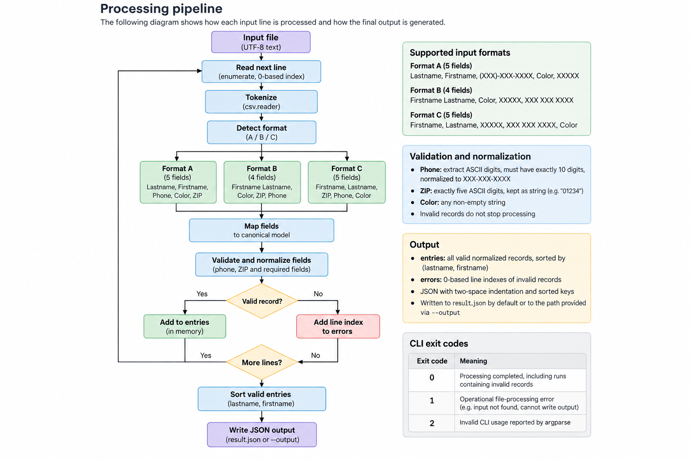

# Data Parser

This project ingests a text file containing personal records, detects the supported record format, normalizes each valid entry into a canonical structure, and writes a single JSON result containing the valid entries and invalid line numbers.

## Requirements

- Python 3.11 or newer
- UTF-8 encoded input files

## Setup

Create a virtual environment and install the application with its test dependency:

```bash
python3 -m venv .venv
source .venv/bin/activate
python -m pip install --upgrade pip
python -m pip install -e ".[dev]"
```

For a runtime-only installation, omit the development extra:

```bash
python -m pip install -e .
```

## Run the CLI

The installed console script is the recommended interface:

```bash
data-parser input.txt
data-parser input.txt --output custom.json
data-parser input.txt --verbose
data-parser --help
```

The module entry point remains available and has the same behavior:

```bash
python -m data_parser.cli input.txt
```

Arguments and options:

- `input_file` is the required path to the input text file.
- `--output PATH` selects the output path. It defaults to `result.json` in the current working directory.
- `--verbose` adds an INFO summary with total, valid, and invalid record counts and the output path.

Logs are written to stderr and never mixed with the JSON output. Invalid records produce warnings containing only their zero-based line index and a general reason; the original record and its personal data are not logged.

### Exit codes

| Code | Meaning |
| ---: | --- |
| `0` | Processing completed, including runs containing invalid records |
| `1` | An operational error prevented the job from completing, such as a missing input file or an output write failure |
| `2` | Invalid command-line usage reported by `argparse` |

## Run tests

After installing the development extra:

```bash
pytest
```

The suite contains unit tests for parsing and validation, pipeline and CLI tests, and an end-to-end fixture test that compares the generated JSON both semantically and textually.

## Quick verification

Process the versioned challenge fixture and inspect the generated output:

```bash
data-parser tests/fixtures/challenge_input.txt
python -m json.tool result.json
```

The generated `result.json` should match `tests/fixtures/challenge_expected.json`.

## Input and output format

The parser accepts newline-delimited records using one of the supported formats:

- Format A: `Lastname, Firstname, (XXX)-XXX-XXXX, Color, XXXXX`
- Format B: `Firstname Lastname, Color, XXXXX, XXX XXX XXXX`
- Format C: `Firstname, Lastname, XXXXX, XXX XXX XXXX, Color`

Phone fields are valid when they contain exactly ten ASCII digits (`0-9`). Other non-digit characters are removed, and valid values are normalized to `XXX-XXX-XXXX`. ZIP codes must contain exactly five ASCII digits and are kept as strings so leading zeros are preserved.

Malformed records, unsupported formats, invalid phone numbers, and invalid ZIP codes do not stop processing. Their original zero-based line indexes are added to `errors`.

Additional input interpretations are documented in [assumptions.md](assumptions.md).

The resulting output JSON has this shape:

```json
{
  "entries": [
    {
      "color": "Blue",
      "firstname": "Booker T.",
      "lastname": "Washington",
      "phonenumber": "703-742-0996",
      "zipcode": "10013"
    }
  ],
  "errors": [1, 3]
}
```

## Processing pipeline

The following diagram shows how each input line is processed and how the final output is generated.


